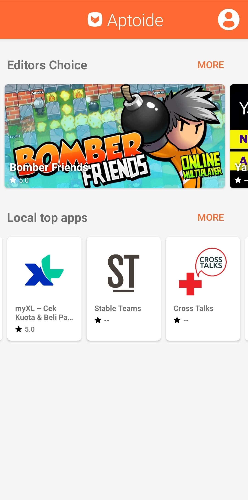
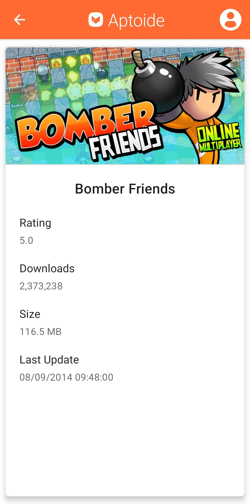
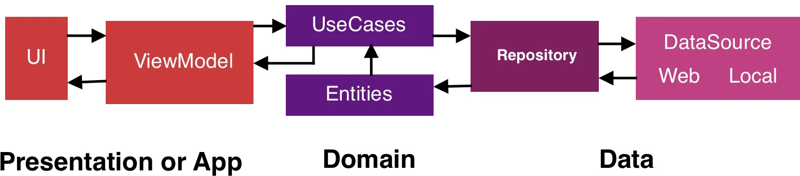

<h1 align="center">
  Aptoide Store
</h1>

This is a sample project created by Bruno Ponte. It uses the Aptoide API to display available apps.

  

  

  
 
  

<h2>Architecture</h2>
This app was implemented using the MVVM design pattern. It also uses CLEAN Architecture to facilitates scalability, maintanability and testability.

   
  

<h2>Libraries</h2>
The following relevant libraries were used:
<ul>
  <li><b>Retrofit</b>: Used to perform the network requests and, with GSON, easily deserialize responses.</li>
  <li><b>Hilt</b>: Used to perform Dependency Injection.</li>
  <li><b>Glide</b>: Used to acquire images from URLs and inflate them in views.</li>
  <li><b>Jetpack Navigation</b>: Used to perform navigation between fragments.</li>
  <li><b>Room</b>: Used to implement local data persitence (cache).</li>
  <li><b>JUnit/Mockito/Espresso</b>: Used to implement Unit and UI tests.</li>
</ul> 

<h2>More</h2>
Implemented:
<ul>
  <li>Caching system</li>
  <li>Unit tests</li>
  <li>UI tests</li>
  <li>Device rotation support</li>
  <li>Dark mode support</li>
</ul> 
